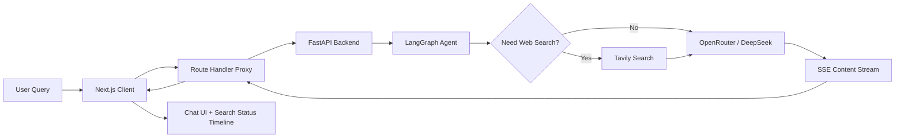

# Web ScrapChat

A full-stack AI search-chat application with a premium glassmorphic frontend, FastAPI backend, and real-time SSE streaming. Unlike the PDF-focused RAG bot in this portfolio, this project is centered on web-first search, live response streaming, and client-server orchestration.

**Status:** Functional prototype  
**Stack:** Next.js, React, Tailwind CSS, FastAPI, LangGraph, OpenRouter, Tavily  
**Focus:** Streaming UX, search orchestration, full-stack AI application design

## Why this project

Search assistants feel dramatically better when the user can see the system working in real time. This repo focuses on the product experience around that idea: progress signals, streaming responses, tool-aware orchestration, and a client-server split that is deployable beyond a notebook demo.

## Core capabilities

- Stream responses token by token to the frontend.
- Trigger live web search when the model needs external information.
- Maintain conversational context through session checkpoints.
- Show explicit search stages such as searching, analyzing, and synthesizing.
- Separate the interface and backend cleanly for deployment.

## Architecture list

1. Client layer
   a. Next.js app for chat UI, status indicators, and markdown rendering  
   b. Proxy route for browser-safe SSE streaming
2. Backend layer
   a. FastAPI service for streaming endpoints  
   b. LangGraph agent loop for tool decisions and memory
3. Search and model layer
   a. Tavily for external search  
   b. OpenRouter / DeepSeek for response synthesis
4. Delivery layer
   a. SSE events for search state and streamed content  
   b. Session continuity across interactions

## Implementation diagram



## Project structure

```text
Web-ScrapChat/
├── client/              # Next.js frontend
│   ├── src/app/         # App router and proxy route
│   └── src/components/  # Chat interface components
├── server/              # FastAPI + LangGraph backend
│   ├── app.py
│   └── requirements.txt
├── docker-compose.yml
├── render.yaml
└── README.md
```

## Run locally

### Backend

```bash
cd server
python -m venv venv
venv\Scripts\activate
pip install -r requirements.txt
uvicorn app:app --reload
```

### Frontend

```bash
cd client
npm install
npm run dev
```

Add these variables in the server environment:

```env
OPENROUTER_BASE_URL=https://openrouter.ai/api/v1
OPENROUTER_MODEL=deepseek/deepseek-v4-flash
OPENROUTER_API_KEY=your_openrouter_api_key
TAVILY_API_KEY=your_tavily_api_key
```

## What this demonstrates

- Full-stack separation between interface, proxy, and agent backend
- Streaming-first UX design for AI products
- Search-tool orchestration through LangGraph
- Deployable AI app structure instead of a single-file prototype

## Next improvements

- Stronger source cards and result ranking summaries
- Better persistence beyond thread checkpoints
- Authentication and saved chat sessions
- More explicit failure handling for tool and API errors
