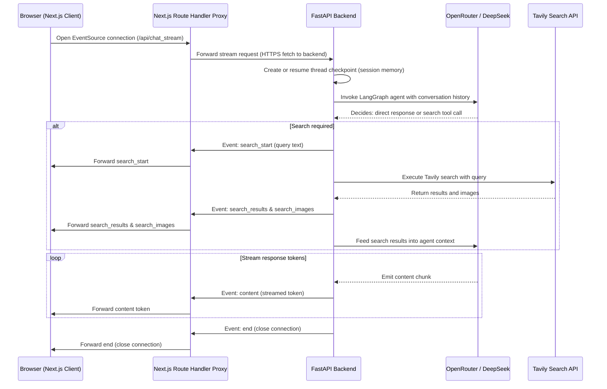

# Web ScrapChat

A modern, responsive AI search-chat assistant with integrated web search functionality. Web ScrapChat provides a clean, premium dark glassmorphic user interface, combining conversational AI with real-time web scraping and search capabilities.

## Features

- **Real-time AI Responses** - Stream AI responses dynamically as they are generated.
- **Integrated Web Search** - AI can search the web for up-to-date information using Tavily Search.
- **Premium Dark UI** - Modern glassmorphic dark theme with glowing state indicators and smooth micro-animations.
- **Rich Markdown Formatting** - Complete inline parsing for bolding, lists, code snippets, and hyperlinks.
- **Conversation Memory** - Maintains context throughout your chat session.
- **Process Transparency** - Clear status progression display (Searching the Web, Analyzing Resources, Synthesizing Answer).

## Architecture

Web ScrapChat follows a client-server architecture:

### Client (Next.js + React)
- Modern React application built with Next.js and custom CSS styling.
- Real-time streaming updates using Server-Sent Events (SSE).
- Custom markdown parser for beautiful message rendering.

### Server (FastAPI + LangGraph)
- Python backend using FastAPI for streaming API endpoints.
- LangGraph framework for orchestrating conversation flow, memory, and search tool triggers.
- Support for OpenRouter API endpoints and DeepSeek models (with local Ollama compatibility fallback).
- Integration with Tavily Search API for web search capabilities.

## Communication and Streaming Flow (SSE)

Instead of using traditional blocking HTTP requests, client-server communication is managed through Server-Sent Events (SSE) via the `/api/chat_stream/{message}` route, proxying requests securely through the Next.js server to prevent client-side domain resolution and CORS issues:

1. **Connection Initiation**: The client browser starts an `EventSource` connection to the Next.js Route Handler at `/api/chat_stream/{message}`.
2. **Request Proxying**: The Next.js server acts as a proxy, forwarding the stream request to the FastAPI backend's URL (`INTERNAL_API_URL`).
3. **Session Verification**: The FastAPI server checks the thread ID (checkpoint) to maintain session continuity.
4. **Agent Invocation**: The FastAPI server triggers the LangGraph agent loop with the conversation history.
5. **Tool Phase (If Required)**:
   - If the model decides a search is needed, it triggers the custom search tool.
   - The FastAPI server pushes a `search_start` event through the proxy to update the client's search status timeline.
   - After retrieving results from Tavily, the server emits `search_results` (source URLs) and `search_images` (visual links) through the proxy to the client.
6. **Synthesis and Streaming**:
   - The search results are injected into the agent's context.
   - As the model responds, the FastAPI server streams the content via continuous `content` events through the proxy, which forwards them directly to the client browser in real-time.
7. **Connection Closure**: Once the response is finished, the FastAPI server sends an `end` event to close the connection cleanly.




## Getting Started

### Prerequisites

- Node.js 18+
- Python 3.10+
- OpenRouter API Key (or Ollama for local setup)
- Tavily API Key

### Installation

1. **Navigate to the project directory**
   ```bash
   cd Web_ScrapChat
   ```

2. **Set up the server**
   ```bash
   cd server
   python -m venv venv
   source venv/bin/activate  # On Windows: venv\Scripts\activate
   pip install -r requirements.txt
   ```

3. **Configure environment variables**  
   Create a `.env` file in the server directory:
   ```env
   OPENROUTER_BASE_URL=https://openrouter.ai/api/v1
   OPENROUTER_MODEL=deepseek/deepseek-v4-flash
   OPENROUTER_API_KEY=your_openrouter_api_key
   TAVILY_API_KEY=your_tavily_api_key
   ```
    
4. **Set up the client**
   ```bash
   cd ../client
   npm install
   ```

### Running the Application

1. **Start the server**
   ```bash
   cd server
   uvicorn app:app --reload
   ```

2. **Start the client**
   ```bash
   cd client
   npm run dev
   ```

3. **Open your browser and navigate to http://localhost:3000**   

## How It Works

1. **User sends a query** through the chat interface.
2. **Server processes the context** using LangGraph and the DeepSeek v4 model on OpenRouter.
3. **AI decides** whether to trigger the Tavily Search tool or answer directly.
4. If search is needed:
   - The search query is executed through the Tavily Search API.
   - Page sources are returned, analyzed, and synthesized by the LLM.
5. **Response is streamed** back to the client in real-time.
6. **Search stages** (Searching, Analyzing, Synthesizing) are displayed to the user via animated status widgets.

## Contributing

Contributions are welcome! Please feel free to submit a Pull Request.

## License

This project is licensed under the MIT License - see the LICENSE file for details.

## Acknowledgments

- Built with [Next.js](https://nextjs.org/), [React](https://reactjs.org/), [FastAPI](https://fastapi.tiangolo.com/), and [LangGraph](https://github.com/langchain-ai/langgraph)
- Powered by [DeepSeek v4 (via OpenRouter)](https://openrouter.ai/) and [Tavily Search API](https://tavily.com/)
